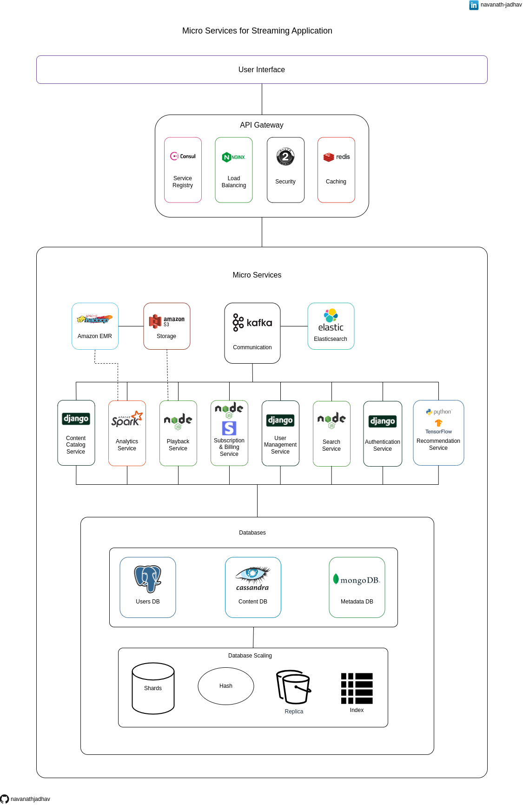

# Micro Services for Streaming Application

This is a comprehensive architecture diagram that outlines the implementation of a scalable and robust streaming platform through microservices. Each independent service handles specific functionalities, resulting in a dynamic and immersive streaming experience for users.

## Show Your Appreciation ⭐

If you find this project helpful, consider giving it a star ⭐ to show your support. Much appreciated!

## Architecture Overview

Take a look at the architecture diagram below:

## Get a PDF Version

Prefer a PDF version? Download it [here](./Micro_Services_for_Streaming_Application.pdf).

## User Interface

At the heart of the platform is the User Interface (UI) layer. This layer is responsible for presenting users with visually appealing components and ensuring seamless interactions. It's the key to delivering an engaging and intuitive user experience.

## API Gateway

The API Gateway acts as the central point for managing client requests. It serves as a bridge between clients and the Micro Services, taking care of tasks like routing, security, caching, and protocol translation. This simplifies the integration process, improves performance, and strengthens overall system security.

### Service Registry using Consul

Service discovery in distributed systems is simplified using Consul, a potent service registry tool. This tool facilitates automatic discovery and registration of microservices. By offering a centralized hub for service availability and health status, Consul enables smooth communication between services.

### Load Balancing using Nginx

For evenly distributing incoming traffic across backend servers, Nginx serves as a reliable web server, reverse proxy, and load balancer. Its intelligence in routing requests among backend servers, following predetermined algorithms (like round-robin and least connections), ensures optimized resource utilization.

### Security using OAuth 2.0

Security receives a boost from OAuth 2.0, the industry-standard authorization framework. It allows controlled access to protected resources without exposing sensitive credentials. With access tokens, it ensures only authorized applications can access user data, enhancing security while maintaining seamless authentication and authorization processes.

### Caching using Redis

Redis, the in-memory data store, plays a pivotal role in caching frequently accessed data, thereby enhancing application performance. With its swift access times, Redis serves cached content promptly, reducing reliance on slower database retrievals. Its flexibility supports various data structures, making it a versatile caching solution.

## Communication using Apache Kafka

Apache Kafka, a robust distributed messaging broker, enables seamless communication between microservices and distributed systems. Acting as an intermediary, Apache Kafka efficiently manages the exchange of messages, fostering asynchronous communication and component decoupling.

### Elasticsearch

Effortlessly manage large volumes of data using Elasticsearch, a powerful search and analytics engine. It optimally indexes and stores data, making it ideal for quick data retrieval and search operations.

## Storage using Amazon S3

Amazon S3, a reliable object storage service, is the choice for storing and retrieving large datasets. It guarantees data durability, availability, and security, making it a trusted solution for reliable data storage within the streaming application.

## Amazon EMR with Apache Hadoop

Amazon EMR, combined with Apache Hadoop, serves as a robust solution for efficient big data processing and analysis. It scales seamlessly, ensuring secure and cost-effective management of large datasets, enriching the streaming platform's capabilities.

## Micro Services

Each micro service takes on a distinct role within the streaming application ecosystem:

### Content Catalog Service using Django

Django takes center stage in the Content Catalog Service, orchestrating content-related functionalities. Leveraging Django's reliability, it efficiently manages content creation, updates, and retrieval. Its non-blocking event-driven architecture ensures high responsiveness and performance.

### Analytics Service using Apache Spark

The Analytics Service, leveraging Apache Spark, serves as the hub for analytics-related functionalities. It effectively manages tasks like user data analysis, streaming analytics, and generating insights.

### Playback Service using Node

Fueled by Node.js, the Video Streaming Service guarantees uninterrupted video playback. Leveraging its asynchronous prowess, this service handles video streaming tasks like user preferences and playback history with smoothness and efficiency.

### Subscription & Billing Service using Node + Stripe

The Subscription & Billing Service, combining Node.js with Stripe integration, ensures secure and efficient subscription management and payment processing. Leveraging Node.js's capabilities and Stripe's robust payment features, it securely handles subscription-related transactions.

### User Management Service using Django

At the core of the User Management Service lies Django, orchestrating user profiles, preferences, and authentication. Django's robust framework adeptly handles user-centric operations, ensuring the seamless management of user-related tasks and elevating the overall user experience to new heights.

### Search Service using Node

Powered by Node.js, the Search Service excels in content discovery and search operations. Its integration with other microservices ensures swift and efficient content retrieval and presentation.

### Authentication Service using Django

The Authentication Service, built using Django, takes charge of user authentication and access control. Django's reliability ensures a secure and seamless authentication process for users.

### Recommendation Service using Python + TensorFlow

The Recommendation Service, crafted with Python and TensorFlow, brings personalized content recommendations to life. By harnessing TensorFlow's machine learning capabilities, it analyzes user behavior to offer relevant and engaging content suggestions.

### Databases

#### Users DB using PostgreSQL

The PostgreSQL-backed User Profiles database stores and manages user information. Leveraging PostgreSQL's robustness and query support, it efficiently stores and retrieves user data, ensuring data integrity through its transactional capabilities. This database plays a pivotal role in delivering a tailored streaming experience.

#### Content DB using Cassandra

The Content Database, backed by Cassandra, effectively organizes streaming app content. Leveraging Cassandra's schema-less architecture, this database seamlessly accommodates a variety of content attributes. With its robust horizontal scaling, it adeptly manages large content volumes, ensuring smooth and efficient content-related operations.

#### Metadata DB using MongoDB

The Metadata database, developed on MongoDB, is a NoSQL repository that proficiently stores and administers flexible and semi-structured content-related metadata within a streaming application. Benefiting from MongoDB's document-oriented architecture, this database facilitates straightforward storage and retrieval of diverse metadata attributes. Its dynamic schema effortlessly adjusts to evolving metadata demands without affecting existing data. Leveraging MongoDB's horizontal scaling prowess, it adeptly manages the storage and organization of varied metadata, cementing its role as a fundamental component of an adaptable and versatile streaming platform.

#### Database Scaling

Advance your platform with sophisticated database scaling techniques:

##### Shards

Employ database sharding to horizontally scale and distribute data across multiple servers or shards. Each shard handles a portion of the data, enhancing performance and enabling parallelized operations.

##### Hash

Utilize data hashing for equitable data distribution across shards. Hashing ensures balanced distribution, preventing data hotspots and load imbalances.

##### Replica

Introduce database replicas to ensure high availability and fault tolerance. Replicas enhance fault tolerance by copying data to multiple servers, offloading read operations and improving performance.

##### Index

Indexes improve query performance by speeding up data retrieval. By mapping indexed values to storage locations, indexes minimize full table scans, expediting query execution.

## Share and Contribute

Found the project valuable? Share it on [Twitter](https://twitter.com/intent/tweet?url=https://github.com/navanathjadhav/Micro-Services-for-Streaming-Application).

## Join the Effort

You're welcome to contribute and enhance this project. Submit a pull request to help create an even richer resource for fellow developers.
